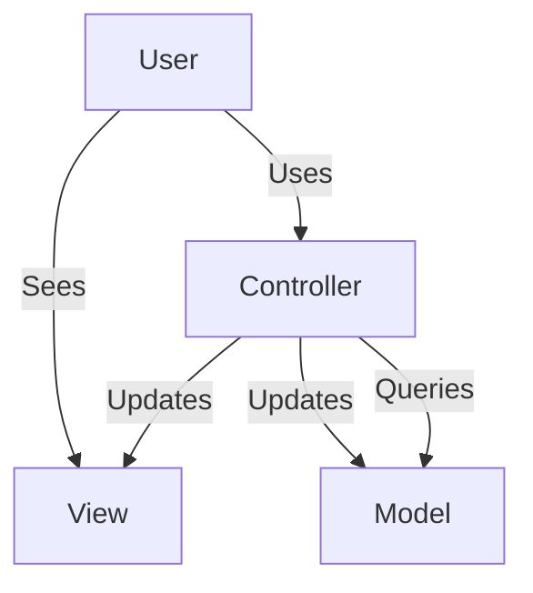
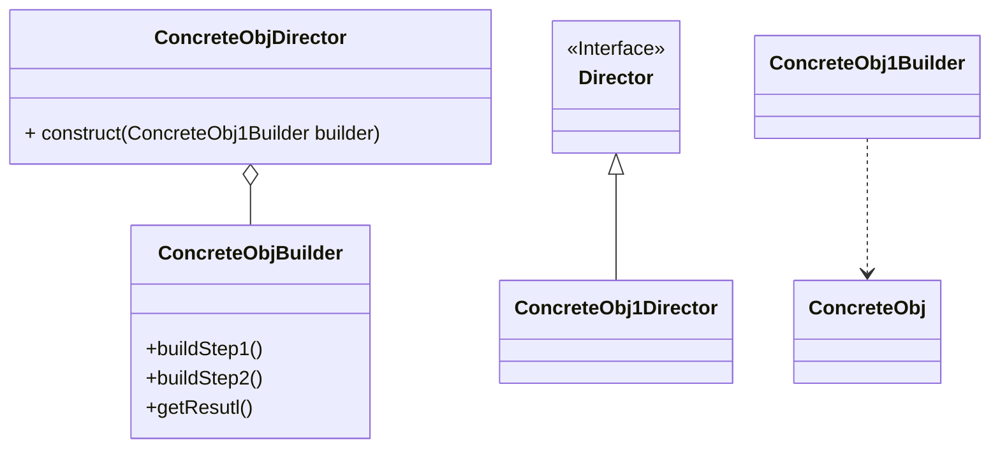
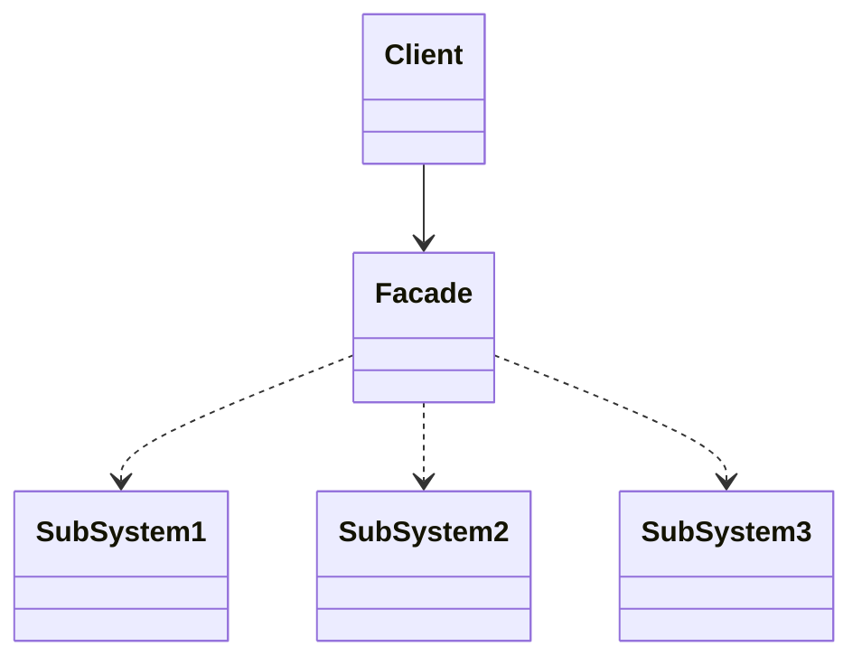
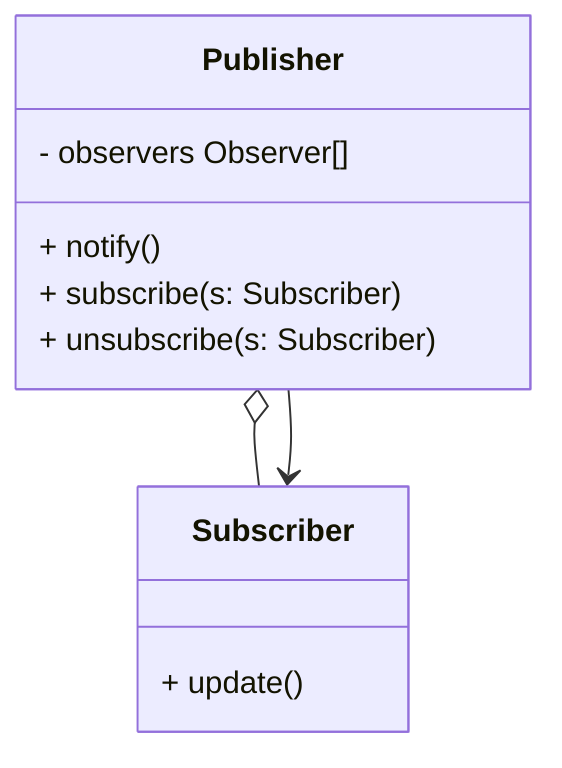
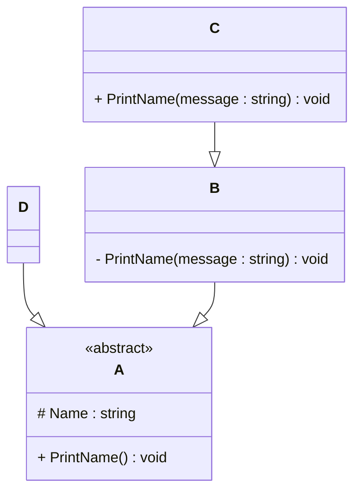

# Programming Test

This test was composed to create a general overview of your knowledge regarding general programming and how it fits with the needs in our lab. Please try to answer all questions using your own knowledge and in your own words. If you get stuck on one of the exercises, still try to give a short answer.

---

## Exercise 1

### Task
Write a program in the language of your choice where:

1. The iteration number (starting from 1), followed by a random number between 1 and 100, is printed 100 times.
2. After every 5 iterations, write an additional separator (e.g., `---`).
3. Write “Lucky number!” after every random number that is divisible by 7.

> Try to keep the procedure as short as possible.

Presuming that by keeping procedure short the only thing we optimize for is LOCs, I propose the following solution in Python,
which I believe should have minimal number of LOCs. However, I suppose that a shorter solution can be found using 
more advanced features of language like lambda expressions:   

```python 
import random

for inter in range(1,101):
    rand = random.randint(2,99)
    print(str(inter) + " " + str(rand))
    if rand % 7 == 0: 
        print("Lucky number")
    if inter % 5 == 0:
        print("-----")
```
Bellow is the same solutions in Java, (another note  is that the boundaries of the random number are not defined explicitly,
and I assume both boundaries to be exclusive) 
```java
import java.util.Random;

class Main {
  public static void main(String[] args) {
    Random ran = new Random();
    for (int inter = 1; inter <= 100; inter++) {
      int rand = ran.nextInt(100 - 2) + 2;
      System.out.println(inter + " " + rand);
      if (rand % 7 == 0)
        System.out.println("Lucky number");
      if (inter % 5 == 0)
        System.out.println("-----");
    }
  }
}
```
---

## Exercise 2

### 1. **What is your understanding of the term “Design Patterns”?**  
> Provide a description in your own words.
 
Design Pattern is commonly used template solution to tackle the widespread problems when creating software. 
Most intuitive example is Singleton, where we aim to prevent creation of more then one instance of a given class.
Design patterns usually assume the software is made using Object-Oriented Paradigm.
   
Since the subsequent question in my opinion incorrectly imply that MVC pattern is a Design Pattern instead of Architectural Pattern,
I also take a liberty to provide a definition of Architectural Pattern there. 

While Architectural Patterns can similarly be described as template solution when developing software, the difference is in scale.
Design patterns are limited to a particular problem withing a software product (overly coupled classes, specific requirement to
a class behaviour, creation or structure.)
Architectural Patterns however describe fundamental structure of the whole software system.

### 2. **Explain the MVC Pattern**  
   - What does MVC stand for?  
   - Explain the pattern in detail.  
   - What are some use cases for this framework?

MVC stands for Model-View-Controller. As a name would imply, the whole software system is comprised of 3 parts:
   - Model contains information needed for the system operation, this would usually be limited to things like Databases.
   - View is concerned with representation, as in UI presenting and retrieving information from user. 
   - Controller mediates the two, updating the View and the Model according to user input

MVC can be very intuitively represented as a diagram

MVC is used primarily in web development and development of desktop applications, the motivation is to ensure that components
related to user interface and data are not coupled and can be developed independently.   


### 3. **List three other design patterns**  
   - Provide names and details for three additional design patterns.
   - Explain how you have used those patterns in the past and how they have solved your problem  
   - Use diagrams to explain the design patterns.

I will provide example of each type of pattern

Creational: Builder

Builder is very useful when you are presented with complex object that require complex, sometimes sequence sensitive 
initialization. The pattern other then an object itself consists from Builder, Director interface and concrete directors.
Builder contains the method necessary for initializing object, while concrete Directors contain predefined initialization
sequences. One could also just use Builder as a type of Factory method. I used it for initializing an image compression algorithm workflow 
from a number algorithm steps objects. This allowed for easy construction of any algorithm as long as individual data
processing steps were already in place. 

Structural: Facade


Facade is a straight forward pattern where we are presented with a problem of complex business logic perhaps from 3rd party
dependencies like image and video libraries. Facade will while limiting the extent to which client is able to interact with 
the subsystem only expose relevant details to the client. I have used it my project exactly for this reason where my
software component handling metrics needed to interact with compression algorithm, and instead of coupling systems directly 
an intermediary was introduced.

Behavioral: Observer


Observer pattern allows for one instance to send signals to interested components one a certain event occurs. I have used it
while attempting to develop an ad-hoc game engine. The idea was that game world consists of entities and systems, whenever the
system would detect an event of interest for the entity it would be updated accordingly. This is realistically the most 
convenient way to achieve this behaviour and as I later found out many engines use Observer pattern as a basis for any development.
Like Godot
---

## Exercise 3

### 1. **Implementation Task**  
   Based on the class diagram below, provide an implementation in any object-oriented programming language of your choice.
   

Bellow the Java and C# code is provided for the presented UML diagram. Every public class is naturally would be localed 
in a separate file in case of Java 
```java
public abstract class ObjectA {

    protected String name;

    public void PrintName() {}

}

public class ObjectB extends ObjectA {
    private void PrintName(String message) {}
}

public class ObjectD extends ObjectA {}

public class ObjectC extends ObjectB {
    public void PrintName(String message) {}
}
```
In case of C# putting every class in the same file is permissible, if .
```cs
using System;

public abstract class ObjectA
{
    protected string name;
    
    public void PrintName(){} 

    public static void Main(string[] args)
    {

    }
}

public class ObjectB : ObjectA{
    private void PrintName(String message){} 
}
    
public class ObjectD : ObjectA{
}
    
public class ObjectC : ObjectB{
    public void PrintName(String message){} 
}
```

### 2. **Key Questions**  
   - Are you able to directly create a new instance of `ObjectA`? Please explain your answer.  

Due to the fact that `ObjectA` is defined in the notation as an abstract class it is not possible to create an instance of this class.    
   - Given an instance of `ObjectC`, are you able to call the method `PrintMessage` defined in `ObjectB`? Please explain your answer.

It is impossible to call the method `PrintMessage` of `ObjectB`, despite `ObjectC` being a child of `ObjectB` due to private assess modifier,
which means the method is only accessible within  class `ObjectB`    
   - Try to explain as many key features of object-oriented programming as you can find in this example.
Inheritance 

Overriding 

Overloading

Polymorphism

Encapsulation

Abstraction


---

## Exercise 4

### Maintaining and Expanding Software for Component Validation

This exercise focuses on strategies for working with existing code bases and ensuring the software remains maintainable as new features and requirements are introduced.

### 1. **Working with Existing Code**  
- How would you approach understanding and contributing to an existing code base with minimal disruption?  


- What practices would you follow to ensure your changes integrate well with the current structure?  

### 2. **Ensuring Maintainability**  
- What techniques would you use to keep the code base clean, modular, and easy to maintain as new features are added?  


- How would you handle code documentation and testing to support long-term maintainability?  

### 3. **Balancing Flexibility and Stability**  
- How would you design or refactor the software to make it flexible for future changes while ensuring the existing functionality remains stable?  


- Which design patterns or principles would you apply to achieve this balance


---
