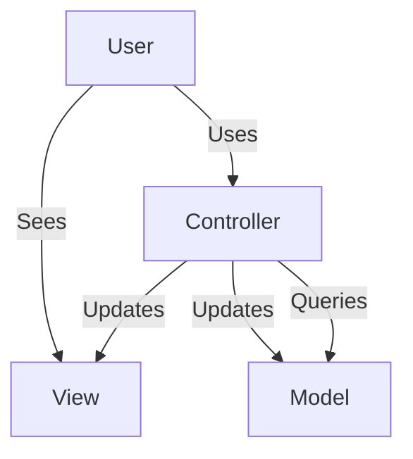
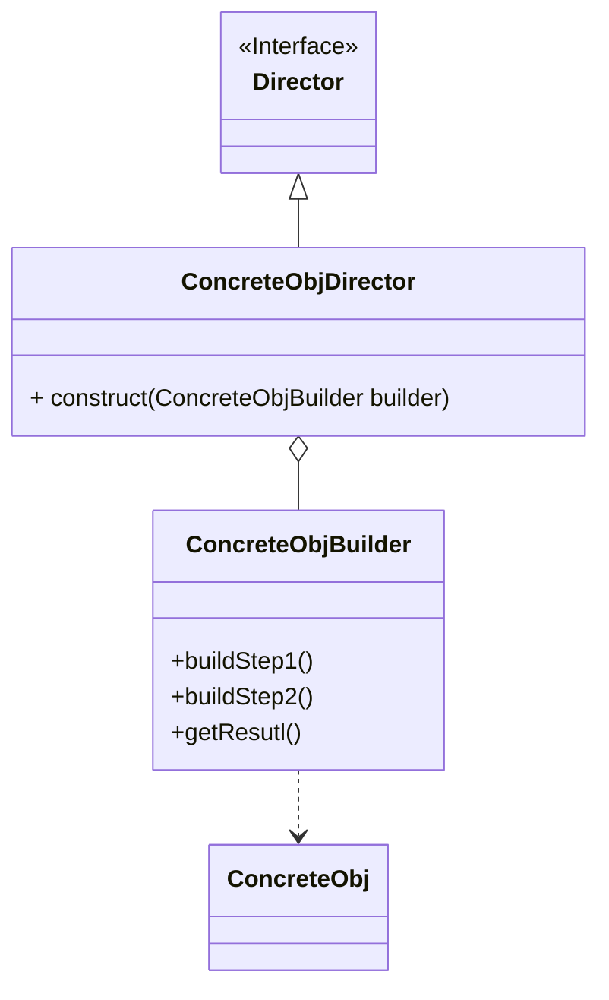
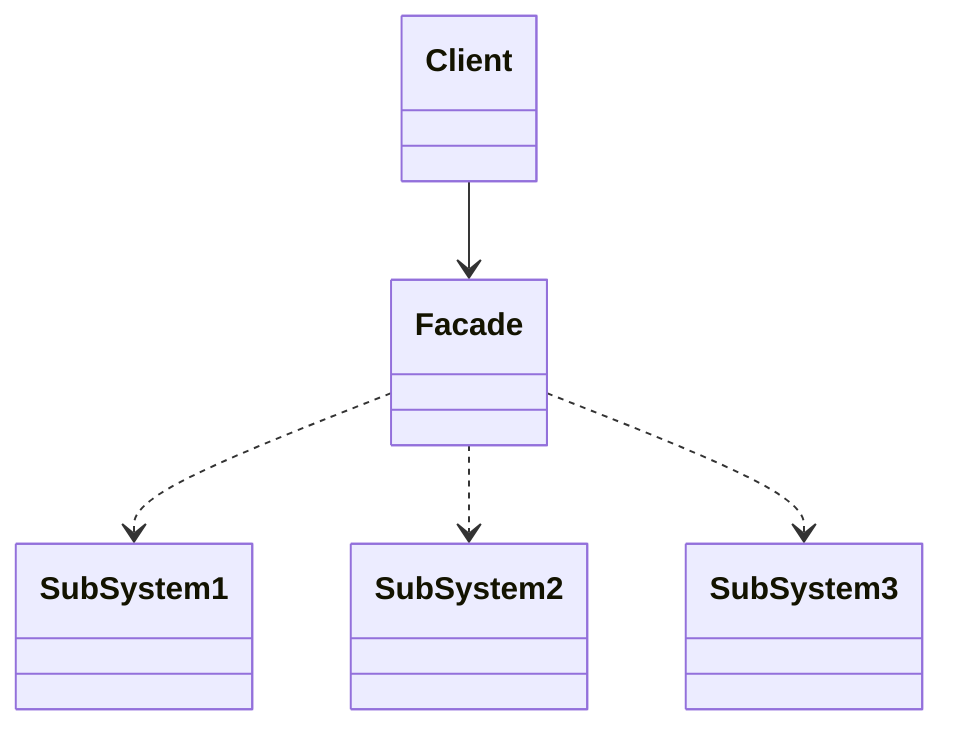
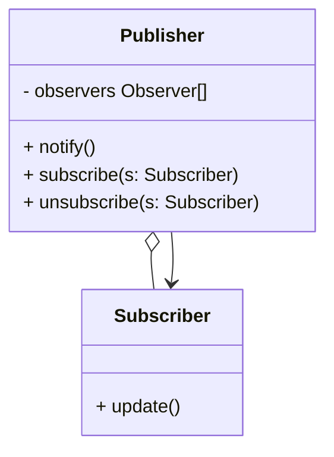
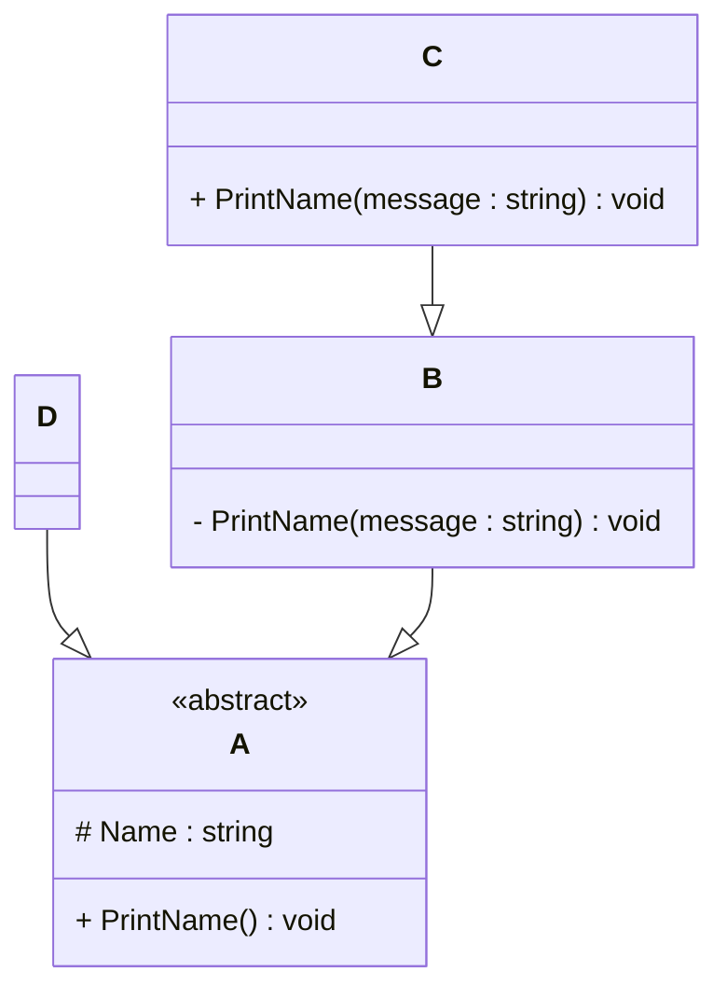

# Programming Test

This test was composed to create a general overview of your knowledge regarding general programming and how it fits with the needs in our lab. Please try to answer all questions using your own knowledge and in your own words. If you get stuck on one of the exercises, still try to give a short answer.

---

## Exercise 1

### Task
Write a program in the language of your choice where:

1. The iteration number (starting from 1), followed by a random number between 1 and 100, is printed 100 times.
2. After every 5 iterations, write an additional separator (e.g., `---`).
3. Write “Lucky number!” after every random number that is divisible by 7.

> Try to keep the procedure as short as possible.

Presuming that by keeping procedure short the only thing we optimize for is LOCs, I propose the following solution in Python,
which I believe should have minimal number of LOCs. However, I suppose that a shorter solution can be found using 
more advanced features of language like lambda expressions:   

```python 
import random
for inter in range(1,101):
    rand = random.randint(2,99)
    print(str(inter) + " " + str(rand))
    if rand % 7 == 0: 
        print("Lucky number")
    if inter % 5 == 0:
        print("-----")
```
Bellow is the same solutions in Java, (another note  is that the boundaries of the random number are not defined explicitly,
and I assume both boundaries to be exclusive). 
```java
import java.util.Random;
class Main {
  public static void main(String[] args) {
    Random ran = new Random();
    for (int inter = 1; inter <= 100; inter++) {
      int rand = ran.nextInt(100 - 2) + 2;
      System.out.println(inter + " " + rand);
      if (rand % 7 == 0)
        System.out.println("Lucky number");
      if (inter % 5 == 0)
        System.out.println("-----");
    }
  }
}
```
This solutions is an attempt to optimize for LOCs using Java and is 3 lines off Python solution. It arguably deviates from 
the specification, since in order to run correctly user needs to define an empty string as a command line argument, other
wise array out of bounds exception would be thrown. 
```java
import java.util.Random;
class Main {
    public static void main(String[] args) {
        for(int inter = 1, rand = new Random().nextInt(101-1) + 1; inter <= 100; inter++, rand = new Random().nextInt(101-1) + 1) {
            args[0] += inter + " " + rand  + "\n";
            args[0] += rand % 7 == 0 ? "Lucky number\n" : "";
            args[0] += inter % 5 == 0 ? "-----\n" : "";
        }
        System.out.println(args[0]);
    }
}
```

---

## Exercise 2

### 1. **What is your understanding of the term “Design Patterns”?**  
> Provide a description in your own words.
 
Design Pattern is commonly used template solution to tackle the widespread problems when creating software. 
Most intuitive example is Singleton, where we aim to prevent creation of more then one instance of a given class.
Design patterns usually assume the software is made using Object-Oriented Paradigm.
   
Since the subsequent question in my opinion incorrectly imply that MVC pattern is a Design Pattern instead of Architectural Pattern,
I also take a liberty to provide a definition of Architectural Pattern there. 

While Architectural Patterns can similarly be described as template solution when developing software, the difference is in scale.
Design patterns are limited to a particular problem withing usually a software component (overly coupled classes, specific requirement to
a class behaviour, creation or structure.)
Architectural Patterns however describe fundamental structure of the whole software system.

### 2. **Explain the MVC Pattern**  
   - What does MVC stand for?  
   - Explain the pattern in detail.  
   - What are some use cases for this framework?

MVC stands for Model-View-Controller. As a name would imply, the whole software system is comprised of 3 parts:
   - Model contains information needed for the system operation, this would usually be limited to things like Databases.
   - View is concerned with representation, as in UI presenting and retrieving information from user. 
   - Controller mediates the two, updating the View and the Model according to user input

MVC can be very intuitively represented as a diagram:

MVC is used primarily in web development and development of desktop applications, the motivation is to ensure that components
related to user interface and data are not coupled and can be developed independently.   


### 3. **List three other design patterns**  
   - Provide names and details for three additional design patterns.
   - Explain how you have used those patterns in the past and how they have solved your problem  
   - Use diagrams to explain the design patterns.

I will provide one example of each type of pattern: creational, structural and behevioral.  

Creational: Builder

Builder is very useful when you are presented with complex object that require complex, sometimes sequence sensitive 
initialization. The pattern other than an object itself consists from Builder, Director interface and concrete directors.
Builder contains the method necessary for initializing object, while concrete Directors contain predefined initialization
sequences. One could also just use Builder as a type of Factory method. I used it for initializing an image compression algorithm workflow 
from a number algorithm steps objects. This allowed for easy construction of any algorithm as long as individual data
processing steps were already in place.

Below is some code snippets in Java related to the Builder pattern.

Consisting part of Algorithm object: AlgorithmStep   
```java
public abstract class AlgorithmStep<T extends DataClass, S extends DataClass> {

    public abstract T performAlgorithmStep(S source) throws UnableToPerformStepException;
}

```
Concrete Object: Algorithm with AlgorithmBuilder as an inner class
```java
public class Algorithm<T extends DataClass, S extends DataClass> {

    private List<AlgorithmStep> steps;

    public Algorithm(AlgorithmBuilder builder) {
        this.steps = builder.steps;
    }

    public T executeAlgorithm(S source){
        DataClass data = source;
        for(AlgorithmStep step : steps){
            data = step.performAlgorithmStep(data);
        }
        return (T) data;
    }

    public static class AlgorithmBuilder{
        private List<AlgorithmStep> steps;

        private AlgorithmBuilder() {
            this.steps = new ArrayList<>();
        }

        public static AlgorithmBuilder newInstance() {
            return new AlgorithmBuilder();
        }

        public AlgorithmBuilder addStep(AlgorithmStep step) {
            this.steps.add(step);
            return this;
        }

        public AlgorithmBuilder addSteps(AlgorithmStep... steps) {
            this.steps.addAll(List.of(steps));
            return this;
        }

        public Algorithm getAlgorithm() {
            return new Algorithm(this);
        }
    }
}
```
Director Interface: AlgorithmDirector
```java
public interface AlgorithmDirector {
    Algorithm defineAlgorithm(Algorithm.AlgorithmBuilder builder, AlgorithmOptions options);
}
```
Concrete Directors:
```java
public class JPEGCompressionDirector implements AlgorithmDirector {

    @Override
    public Algorithm defineAlgorithm(Algorithm.AlgorithmBuilder builder, AlgorithmOptions options) {
        return Algorithm.AlgorithmBuilder.newInstance()
                // compression
                .addStep(new ReadImageFromAFileStep())
                .addStep(new ExtractRGBFromImageStep())
                .addStep(new ConvertRGBtoYUVStep())
                .addStep(new DivideIntoBlocksStep(8))
                .addStep(new ForwardDCTStep())
                .addStep(new QuantizeBlocksStep())
                .addStep(new FlattenBlocksZigZagStep())
                .addStep(new RLEEncodingStep())
                .addStep(new HuffmanEncodingStep())
                .getAlgorithm();
    }
}

public class VideoMetricMeasurementDirector implements AlgorithmDirector {
    @Override
    public Algorithm defineAlgorithm(Algorithm.AlgorithmBuilder builder, AlgorithmOptions options) {
        return Algorithm.AlgorithmBuilder.newInstance()
                .addStep(new ReadImageSequenceFromFileStep())
                .addStep(new ExtractRGBDataFromImageSequenceStep())
                .addStep(new CalculateSequentialMetricsStep(options.outputPath(), COMPREHENSIVE_IMAGE))
                .getAlgorithm();
    }
}
```

Structural: Facade


Facade is a straight forward pattern where we are presented with a problem of complex business logic perhaps from 3rd party
dependencies like image and video libraries. Facade will while limiting the extent to which client is able to interact with 
the subsystem only expose relevant details to the client. I have used it my project exactly for this reason where my
software component handling metrics needed to interact with compression algorithm, and instead of coupling systems directly 
an intermediary was introduced.

Behavioral: Observer


Observer pattern allows for one instance to send signals to interested components one a certain event occurs. I have used it
while attempting to develop an ad-hoc game engine. The idea was that game world consists of entities and systems, whenever the
system would detect an event of interest for the entity it would be updated accordingly. This is realistically the most 
convenient way to achieve this behaviour and as I later found out many engines use Observer pattern as a basis for any development,
like Godot.

The observer was used in different parts of the project. Bellow is an example of possible use for event handling in C#. 
The system I devised is almost can be thought of as 2 layer Observer pattern. Where Event class corresponds to Subscriber
in relationship to Event manager, while being itself a compact implementation of Publisher using delegates.     
```cs
public abstract class Event 
{
    public delegate void EventHandler(EventData e);

    public event EventHandler EventOccurred;

    public void Notify(EventData eventData)
    {
        EventOccurred?.Invoke(eventData);
    }

    public void Subscribe(EventHandler eventHandler)
    {
        EventOccurred += eventHandler;
    }

    public void Unsubscribe(EventHandler eventHandler)
    {
        EventOccurred -= eventHandler;
    }
}
```
EventManager class corresponds to Publisher in the Observer pattern
```cs
public class EventManager 
{
    private readonly Dictionary<Type, Event> events = new Dictionary<Type, Event>();

    public void AddEvent<T>(T eventType) where T : Event
    {
        if (eventType == null)
            throw new ArgumentNullException(nameof(eventType));

        Type type = eventType.GetType();
        if (events.ContainsKey(type))
            throw new ArgumentException($"Event of type {type} already added.");

        events.Add(type, eventType);
    }

    public void RemoveEvent<T>(T eventType) where T : Event
    {
        if (eventType == null)
            throw new ArgumentNullException(nameof(eventType));

        Type type = eventType.GetType();
        if (!events.ContainsKey(type))
            throw new ArgumentException($"Event of type {type} does not exist.");

        events.Remove(type);
    }

    public T GetEvent<T>() where T : Event
    {
        Type type = typeof(T);
        if (!events.TryGetValue(type, out var eventType))
            throw new KeyNotFoundException($"Event of type {type} not found.");

        return (T)eventType;
    }

    public bool HasEvent<T>() where T : Event
    {
        return events.ContainsKey(typeof(T));
    }

    public void Subscribe<T>(Event.EventHandler eventHandler) where T : Event
    {
        if (events.TryGetValue(typeof(T), out var eventType))
        {
            eventType.Subscribe(eventHandler);
        }
    }

    public void Unsubscribe<T>(Event.EventHandler eventHandler) where T : Event
    {
        if (events.TryGetValue(typeof(T), out var eventType))
        {
            eventType.Unsubscribe(eventHandler);
        }
    }

    public void Notify<T>(EventData eventData) where T : Event
    {
        if (events.TryGetValue(typeof(T), out var eventType))
        {
            eventType.Notify(eventData);
        }
    }  
}
```
The code is somewhat bloated because I was trying to achieve very specific behaviour. Wherein the concrete event classes 
could provide very different behaviours thanks to the delegates implementation. The idea was that when a higher lever system
uses the EventManager, it would provide the business logic as a delegate.   


---

## Exercise 3

### 1. **Implementation Task**  
   Based on the class diagram below, provide an implementation in any object-oriented programming language of your choice.
   

Bellow the Java and C# code is provided for the presented UML diagram. Every public class naturally would be localed 
in a separate file in case of Java. 
```java
public abstract class ObjectA {

    protected String name;

    public void PrintName() {}

}

public class ObjectB extends ObjectA {
    private void PrintName(String message) {}
}

public class ObjectD extends ObjectA {}

public class ObjectC extends ObjectB {
    public void PrintName(String message) {}
}
```
In case of C# putting every class in the same file is permissible, if however not recommended.
```cs
using System;

public abstract class ObjectA
{
    protected string name;
    
    public void PrintName(){} 

    public static void Main(string[] args)
    {

    }
}

public class ObjectB : ObjectA{
    private void PrintName(String message){} 
}
    
public class ObjectD : ObjectA{
}
    
public class ObjectC : ObjectB{
    public void PrintName(String message){} 
}
```

### 2. **Key Questions**  
   - Are you able to directly create a new instance of `ObjectA`? Please explain your answer.  

Due to the fact that `ObjectA` is defined in the notation as an abstract class it is not possible to create an instance of this class.    
   - Given an instance of `ObjectC`, are you able to call the method `PrintMessage` defined in `ObjectB`? Please explain your answer.

It is impossible to call the method `PrintMessage` of `ObjectB`, despite `ObjectC` being a child of `ObjectB` due to private assess modifier,
which means the method is only accessible within  class `ObjectB`    
   - Try to explain as many key features of object-oriented programming as you can find in this example.

Inheritance. Every single class expect for base class `ObjectA` is an inheritor. Inheritance is a type of "IS-A" relationship
Child classes can be treated as a super class in many cases, which is crucial for achieving low coupling and is part of 
Liskov's substitution principle.
Polymorphism is tied directly to the Inheritance and is a relationship, because as mentioned before inheritors can be treated as 
any of their parents, hence are all syntactically valid:    
```java
ObjectC c = ObjectC();
ObjectB c = ObjectC();
ObjectA c = ObjectC();
```
Another form of polymorphism is related to methods. Overriding referees to ability to replace the superclass method's functionality
with functionality defined in the child class. When we call this method using the instance of child class we will call child's method.
In this example overriding was not explicitly present, however if `private` modifier in `ObjectB` of method `PrintMessage` was replaced 
with `public` then `ObjectC` would be overriding this method of `ObjectB`. 

Overloading referees to methods using the same name with different parameters, in the example that would be `PrintName(String message)` and
`PrintName()`

Encapsulation is not entirely relevant to this example but is arguably still present. Encapsulation referees to limiting  
direct access to data if not necessity, in our case, field `name` is only accessible to inheritor classes (in case of C#) and 
withing package (in case of Java)

Abstraction aims to provide high level, low detail interfaces to other parts of the program, this helps to reduce coupling and
ensure components can be modified independently. In the example `ObjectA` is an abstract class which we would imagine is 
a high level representation of all child classes


---

## Exercise 4

### Maintaining and Expanding Software for Component Validation

This exercise focuses on strategies for working with existing code bases and ensuring the software remains maintainable as new features and requirements are introduced.

### 1. **Working with Existing Code**  
- How would you approach understanding and contributing to an existing code base with minimal disruption?  

Understanding the code base can be done by personal inference or interacting with the team such as:     
Asking: If it possible the great source of insight will be asking person responsible for the component of interest directly, this     
is also should be the most time efficient option.                                                                             
Testing: In either case test cases would provide the best vehicle to understanding the system, provided they exist, if not 
implementing tests can be used to infer how components work. 
Reading code: Trying to understand code directly is also necessary albeit depending on a system may pose a significant challenge.

Generally when introducing new components into the system, one must design such component that its minimally contradicts 
the SOLID principles. While principles like OCP are sometimes hard to maintain due to evolving nature of software, other
components should not be modified without a good reason and provided a with a healthy code base most changes should stay
fairly contained. Components introduced must be provided with test cases sufficient not only in coverage but in helping
to understand the system develop.

- What practices would you follow to ensure your changes integrate well with the current structure?  

Produced software components must be documented and tested, to ensure they remain maintainable and understandable. 
Designing component before introducing it, it is said that Future refactoring can not be substitute for a good upfront design.
This step should generally not be sidelined and corrected in an impromptu manner when are.        

### 2. **Ensuring Maintainability**  
- What techniques would you use to keep the code base clean, modular, and easy to maintain as new features are added?  

Testing coverage and test quality must be maintained high, changes must be accepted with a code review process for a greater 
cooperation, expertise sharing and ultimately better quality of code itself. Metrics to monitor the software product health 
like coupling, complexity, and even naive LOCs counts can help identify emerging design erosion problems and code smells   

- How would you handle code documentation and testing to support long-term maintainability?

While it is said that code should be understandable without a documentation, achieving a great enough level of clarity for
everything is unfeasible. Ideally each class and method should be clearly annotated for its intent and purpose. Testing should
achieve high line coverage as well as branch coverage, but this not enough in and on itself and test should be meaningful
testing different edge cases. If resources allow for it mutation testing can also be perform to make sure that tests that are
in place do not produce incorrectly optimistic results  

### 3. **Balancing Flexibility and Stability**  
- How would you design or refactor the software to make it flexible for future changes while ensuring the existing functionality remains stable?  

Refactoring is an iterative process, naturally test cases should be in place to verify refactoring results but beyond that 
if refactoring is done along the particular code smell or SOLID principle, then refactor should be limited to the components
affected by this issue exclusively, minimising number of unintentional and disruptive changes that could be introduced.   
No sweeping changes or redesigns that do not address the issue directly   

- Which design patterns or principles would you apply to achieve this balance
 
SOLID principle is a guiding principle to ensure software is designed with and does not lose flexibility and maintainability 
required from a modern software product. Single Responsibility Principle is important to maintaining to avoid emergence of
high coupling low cohesion god classes. Open Closed Principle when violated can point at missing abstraction layers.
Linkovs Substitution Principle can identify overoptimistic generalisations and abstractions. Interface Segregation Principle
similarly can point to overgeneralized interfaces, that may require splitting. Dependency Inversion Principle can help greatly 
reduce overall coupling of system. 
KISS - keep it simple stupid, complex solutions should be avoided in favour of simpler 
once if possible. Every existing design pattern has its time and place, some more wide spread, then others. Such design patterns
as Factory are likely to be used in many components since value of decoupling objects initialization often can improve cohesion  

---
